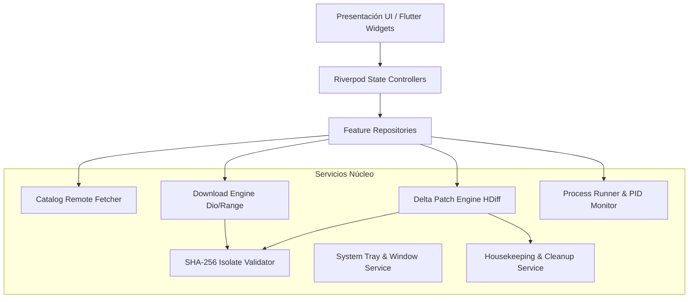

# Documento Maestro de Especificación y Arquitectura: HakkinLauncher

> **Versión del Documento:** 1.0.0  
> **Estado:** Aprobado / En Construcción  
> **Autor:** HakkinDavid & Antigravity  
> **Fecha:** Octubre 2026  
> **Ecosistema:** Flutter Desktop (macOS, Windows, Linux) & Mobile (Android, iOS)

---

## 1. Resumen Ejecutivo y Visión del Producto

### 1.1 Contexto del Problema
A lo largo de los años, el desarrollo de aplicaciones de escritorio, utilidades y videojuegos distribuidos de forma independiente a través de GitHub Releases ha evidenciado una severa **barrera de fricción para los usuarios no técnicos**:
- **Desconocimiento y falta de monitorización:** Los usuarios no comprueban periódicamente las releases de GitHub. Al encontrar un fallo o bug, suelen abandonar el software en lugar de buscar la actualización.
- **Dificultad operativa en la actualización manual:** Descargar un archivo comprimido (`.zip`), extraerlo, ubicar el directorio original y sobrescribir binarios respetando archivos de configuración o partidas guardadas es un proceso propenso a errores para el usuario promedio.
- **Coste de ancho de banda y transferencia innecesaria:** En videojuegos o programas pesados (de cientos de megabytes a varios gigabytes), descargar el paquete completo por un hotfix de pocos megabytes genera frustración y gasto de recursos.
- **Fatiga por redundancia técnica:** Desarrollar sistemas de auto-actualización específicos para cada proyecto (en distintos motores o lenguajes como Godot, Unity, C++, Rust, C#) multiplica la deuda técnica y el mantenimiento.

### 1.2 La Solución: HakkinLauncher
**HakkinLauncher** es un cliente universal de descubrimiento, instalación, ejecución y actualización inteligente para todo el ecosistema de software y videojuegos del desarrollador. Funciona como una tienda/biblioteca moderna inspirada en **Epic Games Store** y **Steam**, pero de código abierto y sin barreras de pago (libre de paywalls).

Sus pilares fundamentales son:
1. **Catálogo Centralizado en Caliente:** Carga dinámica de un diccionario JSON desde el repositorio maestro, con persistencia y funcionamiento offline.
2. **Actualizaciones Diferenciales (Delta Patching):** Soporte de parches binarios con `HDiffPatch` (`hpatchz`) para descargar únicamente las diferencias entre versiones, con verificación estricta de hash SHA-256 y fallback automático a descarga limpia completa.
3. **Preservación Contractual de Datos de Usuario:** Respeto estricto de rutas de guardado (`saves/**`, `config/**`, etc.) durante instalaciones, actualizaciones y limpiezas.
4. **Presencia en Segundo Plano:** Minimizado a la bandeja del sistema (System Tray en Windows / Menu Bar en macOS) con chequeos silenciosos de nuevas versiones y notificaciones nativas.
5. **Auto-actualización del Propio Lanzador (Self-Update):** Capacidad del cliente de actualizarse a sí mismo de manera atómica sin corromperse y reabrirse automáticamente.
6. **Diseño Visual Platino & Noche:** Estética inmersiva, elegante y oscura inspirada en la Epic Games Store con toques lunares y metálicos platino.

---

## 2. Requisitos del Sistema

### 2.1 Requisitos Funcionales (RF)

#### Módulo 1: Catálogo y Diccionario de Aplicaciones
- **RF-01.1 (Carga Remota en Caliente):** El sistema consulta la URL configurada para obtener el manifiesto maestro `catalog.json` al arrancar.
- **RF-01.2 (Caché Offline Persistente):** Si no hay conexión o la petición falla, el lanzador utiliza la última copia válida persistida en el almacenamiento local.
- **RF-01.3 (Validación de Esquema):** Valida la integridad estructural del JSON antes de reemplazar el catálogo local.
- **RF-01.4 (Sondeo Programado):** En segundo plano, comprueba cada intervalo definido si hay cambios en el catálogo remoto.

#### Módulo 2: Exploración, Búsqueda y Tienda
- **RF-02.1 (Página Principal estilo EGS):** Hero Banner destacado, carruseles horizontales y grilla visual de programas/juegos.
- **RF-02.2 (Buscador y Filtros):** Filtrado reactivo en tiempo real por término de búsqueda, categoría (`game` / `app`), etiquetas y compatibilidad de plataforma.
- **RF-02.3 (Ficha de Producto):** Vista de detalle con galería de imágenes/capturas, descripción en Markdown, ficha técnica, historial de versiones y botón dinámico según estado (Instalar, Actualizar, Jugar, En Ejecución).

#### Módulo 3: Descarga, Instalación y Registro
- **RF-03.1 (Descargador Resumible):** Descargas mediante HTTP con soporte de cabeceras `Range` para reanudar descargas interrumpidas. Emisión de eventos de progreso (porcentaje, velocidad en MB/s, tiempo restante estimado).
- **RF-03.2 (Extracción y Staging Atómico):** Los archivos descargados se descomprimen en un directorio temporal de staging antes de consolidarse en la carpeta definitiva de la aplicación.
- **RF-03.3 (Scripts Pre y Post Instalación):** Ejecución de scripts definidos en el manifiesto (`.bat`/`.ps1` en Windows, `.sh` en macOS/Linux) para resolver dependencias o registrar el software.
- **RF-03.4 (Accesos Directos y Registro en el S.O.):** Creación de accesos directos en el Escritorio y Menú Inicio en Windows, o registro en Launchpad/Aplicaciones en macOS.

#### Módulo 4: Motor de Actualización Inteligente (Delta Updates & Fallback)
- **RF-04.1 (Comparación Semántica de Versiones):** Detección de versión local instalada vs versión más reciente en el catálogo (usando SemVer).
- **RF-04.2 (Selección de Estrategia Delta):** Si existe un paquete de actualización diferencial para el salto específico de versión (`from_version` == `installed` && `to_version` == `latest`), se descarga el parche `.hdiff`.
- **RF-04.3 (Verificación de Integridad de Parche):** Cálculo del hash SHA-256 del archivo de parche antes de aplicarlo.
- **RF-04.4 (Aplicación de Parche con HDiffPatch):** Ejecución asíncrona de `hpatchz` en un hilo/proceso secundario.
- **RF-04.5 (Verificación Post-Patch):** Comprobación del hash SHA-256 del binario resultante contra el `target_sha256` declarado.
- **RF-04.6 (Fallback Automático Transaccional):** Si el parche falla, arroja un hash no coincidente o no existe delta para esa versión, el motor descarga automáticamente el paquete completo (`full_package`) e instala una copia limpia.
- **RF-04.7 (Aislamiento y Protección de Datos de Usuario):** Las rutas declaradas en `protected_user_paths` (partidas guardadas, ficheros `.ini`, configuraciones) nunca se sobrescriben ni eliminan durante actualizaciones o limpiezas.

#### Módulo 5: Ejecución y Monitoreo de Procesos
- **RF-05.1 (Lanzamiento de Aplicaciones):** Ejecución del binario principal indicado en `executable_relative_path`.
- **RF-05.2 (Control de Procesos Activos):** Detección en tiempo real del PID. Si el juego o programa está en ejecución, se bloquea la opción de actualizar o desinstalar para prevenir colisiones de ficheros bloqueados por el sistema operativo.
- **RF-05.3 (Argumentos Personalizados):** Configuración de parámetros de línea de comandos por aplicación.

#### Módulo 6: Segundo Plano y Notificaciones
- **RF-06.1 (Bandeja del Sistema / Menu Bar):** Icono persistente en el System Tray (Windows) y Status Bar (macOS) con menú rápido interactivo.
- **RF-06.2 (Comportamiento de Ventana):** Opción para minimizar a la bandeja al cerrar la ventana principal.
- **RF-06.3 (Notificaciones Nativas):** Alertas al usuario cuando se detecta una nueva versión disponible o cuando culmina una instalación/actualización.

#### Módulo 7: Mantenimiento (Housekeeping)
- **RF-07.1 (Limpieza de Temporales):** Borrado de instaladores `.zip`, parches `.hdiff` y temporales tras validar la instalación.
- **RF-07.2 (Rotación de Logs):** Límite máximo de retención para ficheros de registro (10 MB / 7 días).
- **RF-07.3 (Verificación y Reparación de Archivos):** Herramienta manual para cotejar los hashes de la instalación local y re-descargar únicamente ficheros corruptos.

#### Módulo 8: Auto-Actualización de HakkinLauncher (Self-Update)
- **RF-08.1 (Detección de Nueva Versión del Lanzador):** Lectura del campo `launcher_meta` en el catálogo.
- **RF-08.2 (Descarga Atómica de Reemplazo):** Descarga del nuevo binario/bundle en staging.
- **RF-08.3 (Reemplazo y Relanzamiento Autónomo):** Ejecución de un helper independiente que espera la terminación del proceso principal de HakkinLauncher, intercambia los binarios y reabre el launcher de forma inmediata.

---

### 2.2 Requisitos No Funcionales (RNF)

| Código | Área | Descripción y Métricas |
| :--- | :--- | :--- |
| **RNF-01** | **Multiplataforma** | Base de código única en Flutter. Fase 1 / MVP focalizada en macOS (Apple Silicon y x64) y Windows (x64). Fase 2 extenderá a Linux, Android e iOS. |
| **RNF-02** | **Consumo de Recursos** | En estado minimizado/reposo en bandeja: RAM $\le 85\text{ MB}$, CPU $\le 0.1\%$. |
| **RNF-03** | **Responsividad de UI** | Renderizado a 60/120 FPS sin bloqueos en el hilo principal. Cálculos criptográficos de SHA-256 y patching ejecutados en `Isolate`s o subprocesos. |
| **RNF-04** | **Seguridad** | Verificación obligatoria de SHA-256 en toda descarga. Ejecución controlada de scripts con registro en logs. |
| **RNF-05** | **Identidad Visual** | Diseño oscuro "Platino y Noche Lunar": Fondo Abyss (`#0A0D14`), Superficie Obsidian (`#131822`), Acentos Platino Metálico (`#E2E8F0`). |

---

## 3. Arquitectura del Sistema

---

## 4. Contrato de Datos (Diccionario / Catálogo JSON)

El catálogo remoto debe publicarse en una URL pública accesible (ejemplo en GitHub raw o assets) con la siguiente estructura de campos obligatorios y opcionales:

- **`version`** *(string)*: Versión del esquema del catálogo.
- **`catalog_timestamp`** *(string ISO-8601)*: Fecha/hora de última actualización del catálogo.
- **`launcher_meta`** *(object)*: Metadatos para el self-update de HakkinLauncher (`latest_version`, descargas por plataforma y SHA-256).
- **`apps`** *(array)*: Lista de programas y videojuegos gestionados.
  - **`id`** *(string)*: Identificador único (`com.hakkin.appname`).
  - **`title`** *(string)*: Nombre público visible.
  - **`category`** *(string: "game" | "app")*: Tipo de producto.
  - **`assets`** *(object)*: Icono, banner, póster y capturas de pantalla.
  - **`latest_version`** *(string)*: Versión pública más reciente.
  - **`platforms`** *(object)*: Mapeo de arquitecturas (`windows-x64`, `macos-arm64`, `macos-x64`, `linux-x64`).
    - **`executable_relative_path`**: Ruta relativa al ejecutable principal.
    - **`full_package`**: Objeto con `url`, `size_bytes`, `sha256`.
    - **`delta_updates`**: Array de objetos delta (`from_version`, `to_version`, `patch_format`, `url`, `size_bytes`, `patch_sha256`, `target_sha256`).
    - **`protected_user_paths`**: Array de patrones glob que no se deben sobrescribir (ej. `saves/**`, `user_config.ini`).
    - **`scripts`**: Scripts opcionales `pre_install` y `post_install`.

*(El esquema JSON formal completo se encuentra en `docs/CATALOG_SCHEMA.json`).*
